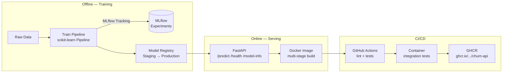
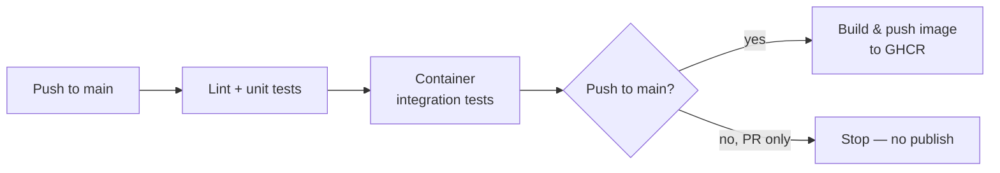

# Churn Prediction — End-to-End MLOps Pipeline

A production-style MLOps pipeline for a customer churn classification model: modular training with experiment tracking, a versioned model registry, a REST inference API, multi-stage containerization, and a fully automated CI/CD pipeline that builds, tests, and publishes a container image on every push.

This project was built as a portfolio piece to demonstrate the engineering and automation layer around a machine learning model — not just the model itself.

---

## Table of Contents

- [Architecture](#architecture)
- [Tech Stack](#tech-stack)
- [Project Structure](#project-structure)
- [Getting Started](#getting-started)
- [MLflow: Tracking & Model Registry](#mlflow-tracking--model-registry)
- [API Reference](#api-reference)
- [Testing Strategy](#testing-strategy)
- [Docker](#docker)
- [CI/CD Pipeline](#cicd-pipeline)
- [Architecture Decisions & Lessons Learned](#architecture-decisions--lessons-learned)
- [Known Limitations & Future Improvements](#known-limitations--future-improvements)

---

## Architecture



**Two distinct lifecycles, deliberately separated:**

- **Training (offline):** runs on demand, whenever the model needs to be retrained or a new candidate compared. Produces a versioned artifact in the Model Registry.
- **Serving (online):** runs continuously. Loads whatever model is currently marked `Production` in the registry and exposes it over HTTP.

Decoupling these two halves means the API's code can change (new endpoint, new validation rule) without ever touching the training code, and the model can be retrained and promoted without redeploying the API's source code — only its container needs to pick up the new registry pointer.

---

## Tech Stack

| Layer | Tool |
|---|---|
| Language | Python 3.12 |
| Modeling | scikit-learn, XGBoost |
| Experiment tracking & registry | MLflow (SQLite backend for local/portfolio use) |
| API framework | FastAPI + Pydantic |
| Testing | pytest, httpx, requests |
| Containerization | Docker (multi-stage build), docker-compose |
| CI/CD | GitHub Actions |
| Container registry | GitHub Container Registry (GHCR) |

---

## Project Structure

```
mlops-churn-project/
├── app/                       # Inference service (serving layer)
│   ├── main.py                 # FastAPI app and route definitions
│   ├── schemas.py               # Pydantic request/response contracts
│   └── model_loader.py          # Loads the model from the MLflow Registry
├── src/                       # Training pipeline (offline layer)
│   ├── data.py                  # Loading, cleaning, train/test split
│   ├── train.py                  # Orchestrates training + MLflow logging
│   └── evaluate.py               # Shared evaluation metrics
├── tests/
│   ├── test_api.py               # Unit tests against the FastAPI app (no Docker)
│   └── test_container.py          # Integration tests: build + run the real image
├── data/
│   ├── raw/                     # Original dataset (not tracked, except .gitkeep)
│   └── processed/                # Generated intermediate data
├── notebooks/                 # Exploratory analysis only — never the pipeline
├── mlruns/                    # MLflow artifact store (tracked — see note below)
├── mlflow.db                   # MLflow tracking backend, SQLite (tracked — see note below)
├── .github/workflows/ci.yml    # CI/CD pipeline definition
├── Dockerfile                   # Multi-stage build for the API image
├── docker-compose.yml            # Orchestrates API + MLflow UI locally
├── requirements.txt
└── README.md
```

`app/` and `src/` are intentionally separate packages: one serves, one trains. Both can import shared logic from `src/data.py` when preprocessing needs to be identical in both contexts — which it must be, to avoid training/serving skew (see below).

---

## Getting Started

### Option 1 — Docker Compose (recommended)

Spins up both the API and a local MLflow UI, sharing the same tracking database via volume mounts:

```bash
docker-compose up --build
```

- API docs: http://localhost:8000/docs
- MLflow UI: http://localhost:5000

### Option 2 — Local Python environment

```bash
python -m venv venv
venv\Scripts\activate          # Windows
source venv/bin/activate       # macOS/Linux

pip install --upgrade pip
pip install -r requirements.txt

# Train and register a model (see MLflow section below)
python -m src.train

# Run the API
uvicorn app.main:app --reload --port 8000
```

### Option 3 — Pull the published image

Every push to `main` that passes CI publishes a new image to GHCR:

```bash
docker pull ghcr.io/giuliabugatti09/churn-api:latest
docker run -p 8000:8000 ghcr.io/<your-username>/churn-api:latest
```

---

## MLflow: Tracking & Model Registry

The training pipeline logs every run — parameters, metrics, and the fitted model artifact — to an MLflow Tracking server backed by SQLite:

```bash
mlflow ui --backend-store-uri sqlite:///mlflow.db --default-artifact-root ./mlruns
```

The best candidate is registered under the name `churn-classifier` and promoted through stages:

```
None → Staging → Production → (Archived on replacement)
```

The API never hardcodes a specific model version — it always resolves `models:/churn-classifier/Production` at startup, so promoting a new version in the registry is enough to change what the API serves, with no code change required.

**Model artifact design:** the registered model is a `sklearn.Pipeline` containing both the `StandardScaler` and the classifier, not the classifier alone. This was a deliberate fix (see [Lessons Learned](#architecture-decisions--lessons-learned)) to guarantee the API applies the exact same preprocessing used at training time.

---

## API Reference

| Method | Path | Description |
|---|---|---|
| `GET` | `/health` | Liveness check for orchestration/monitoring |
| `GET` | `/model-info` | Metadata of the currently loaded model (name, version, stage) |
| `POST` | `/predict` | Returns a churn prediction and probability for a given customer |

**Example request to `/predict`:**

```json
{
  "tenure": 12,
  "MonthlyCharges": 70.5,
  "TotalCharges": 845.0,
  "SeniorCitizen": 0
}
```

**Example response:**

```json
{
  "churn_prediction": 0,
  "churn_probability": 0.18
}
```

Interactive documentation (Swagger UI), generated automatically from the Pydantic schemas, is available at `/docs` whenever the API is running.

---

## Testing Strategy

The project tests at two different levels, intentionally:

1. **`tests/test_api.py`** — exercises the FastAPI application directly via `TestClient`, without Docker. Fast feedback loop; runs on every CI push.
2. **`tests/test_container.py`** — builds the actual Docker image, runs it as a real container, and hits it over HTTP. This validates the deployment artifact itself, not just the source code — catching issues (like the path-resolution bug described below) that only surface once the app runs inside its container.

```bash
pytest tests/test_api.py -v          # fast, code-level tests
pytest tests/test_container.py -v    # slower, full image build + run
```

---

## Docker

The `Dockerfile` uses a **multi-stage build**:

- **`builder` stage** — installs Python dependencies, including any that require compilation.
- **Final stage** — copies only the installed packages and application code, leaving build tooling behind. Keeps the runtime image leaner and reduces its attack surface.

`docker-compose.yml` additionally mounts `mlflow.db` and `mlruns/` from the host as volumes, so the API and MLflow UI containers always see the latest state without requiring an image rebuild after every training run — a convenience for local development that would be replaced by a remote MLflow Tracking Server in a real production setup.

---

## CI/CD Pipeline

Defined in `.github/workflows/ci.yml`, triggered on every push and pull request to `main`:



1. **`lint-and-test`** — runs `flake8` and the fast API unit tests.
2. **`test-container`** — builds the real Docker image and runs the container integration tests. Only runs if the first job passes.
3. **`build-and-push`** — only on pushes to `main` (never on pull requests), builds and publishes the image to GHCR, tagged both `latest` and with the commit SHA for traceability. Only runs if both prior jobs pass.

Each job gates the next, so a broken container build or a failing test blocks the image from ever being published.

---

## Architecture Decisions & Lessons Learned

**1. `sklearn.Pipeline` to prevent training/serving skew.**
Early in development, the `StandardScaler` was fit during training but never persisted alongside the model — meaning the API had no reliable way to reproduce the exact same scaling at inference time. This is a classic (and often silent) MLOps failure mode: predictions degrade because the serving-time preprocessing subtly diverges from training-time preprocessing, without throwing any error. The fix was to wrap the scaler and classifier in a single `sklearn.Pipeline`, logged and registered as one artifact — so raw, unscaled input is always transformed identically, wherever it's consumed.

**2. Local MLflow (SQLite) artifact paths are not portable — and the problem runs deeper than expected.**
MLflow's local file-based backend stores **absolute** artifact paths, not relative ones, and it stores them in *multiple, independent places*: `experiments.artifact_location`, `runs.artifact_uri`, `model_versions.source`, and — less obviously — `model_versions.storage_location` (a column prioritized specifically by `get_model_version_download_uri()`, the method `mlflow.sklearn.load_model()` uses internally). Correcting only some of these columns produced inconsistent, confusing behavior: a manual diagnostic call would resolve a path correctly, while the actual `load_model()` call — used by the running API — would still fail with the old, Windows-absolute path. All four locations had to be corrected via direct SQL updates for the model to load correctly inside a Linux container built from a Windows development machine.
In a real production setup, this entire class of problem is avoided by using a remote MLflow Tracking Server with centralized artifact storage (S3, Azure Blob, etc.), which is designed around absolute, but *consistent*, URIs shared by every consumer.

**3. Multi-stage Docker builds don't always shrink image size significantly for ML workloads.**
The bulk of the image's size comes from scientific Python libraries (pandas, scikit-learn, xgboost), not from application code or debug scripts. Excluding non-essential files via `.dockerignore` was worth doing for cleanliness, but did not meaningfully change the final image size — a useful, if slightly humbling, reminder that not every "best practice" optimization moves the needle equally in every context.

**4. Feature ordering is an implicit contract between training and serving.**
A `ValueError` surfaced in the API (but not in isolated model-loading tests) because the DataFrame built from the Pydantic schema didn't match the column order the `StandardScaler` was fit on. `sklearn` pipelines validate feature *names and order* strictly at predict time. This was patched by fixing the field order to match, but it remains a fragile, implicit agreement across files rather than a single source of truth — see below.

---

## Known Limitations & Future Improvements

- **Feature order is not yet centralized.** The column order expected by the model is currently kept in sync manually across `src/data.py`, `app/schemas.py`, and `app/main.py`. A shared `FEATURE_COLUMNS` constant, imported by both the training and serving code, would make this order impossible to desynchronize.
- **MLflow backend is local SQLite + local file artifacts**, versioned directly in Git for CI simplicity. In a real deployment this would be replaced by a remote MLflow Tracking Server with object storage (S3/Azure Blob/GCS) for artifacts, removing the need to commit `mlflow.db` and `mlruns/` to version control at all.
- **Only numeric features are used** by the current model (`tenure`, `MonthlyCharges`, `TotalCharges`, `SeniorCitizen`). The original dataset includes several categorical features (contract type, payment method, subscribed services) likely to be predictive of churn; incorporating them (via one-hot/target encoding inside the same `sklearn.Pipeline`) is a natural next iteration.
- **No staged rollout or shadow deployment.** Promotion to `Production` in the registry is immediate and manual; a more mature setup would gate this behind automated evaluation thresholds or a canary deployment strategy.
- **No authentication on the API.** Out of scope for this portfolio project, but would be required before any real-world exposure.

---

## License

This project is provided as-is for portfolio and educational purposes.
